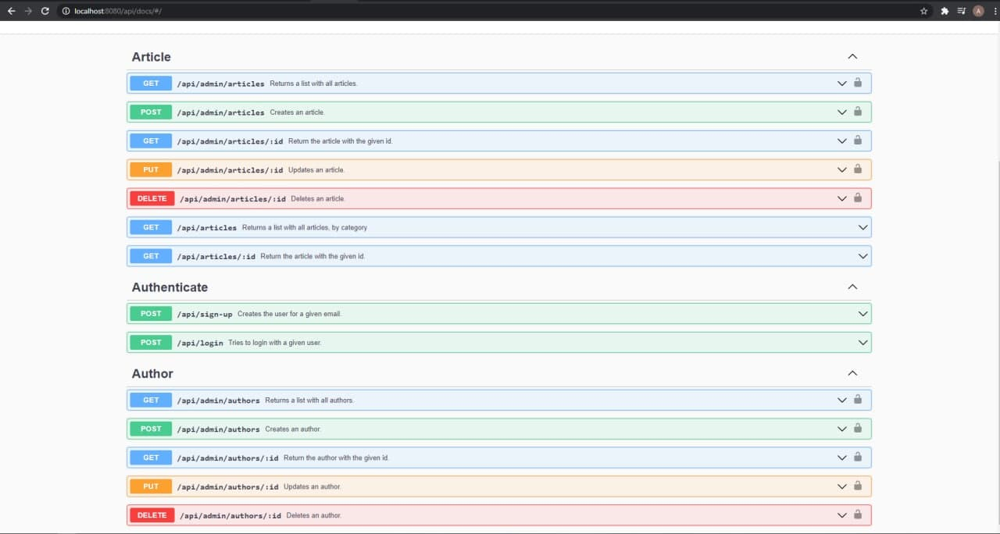

# Jungle Devs - Node Challenge #001

## Run in development mode

Execute this command:

```
docker-compose up
```

Then, access this endpoint to run the migrations and seeds:

```
http://localhost:8080/api/migrate
```

## Create production build

Execute this command:

```
docker-compose -f docker-compose.yml build
```

## Documentation

This API was documenten using swager-ui and jsdoc libs.
It's exposed in the following endpoint:

```
http://localhost:8080/api/docs
```

<p align="center"></p>
